# Temporal features of models

What types of timeseries does each model produce?

* Deaths
* Number of hospital beds
* ICU cases
* Infections
* R value

# Characteristics of curves

Here is a list of all feature descriptors of the timeseries curves. These can
then be filtered or searched to find "interesting" or similar curves. This is a
combination of the idea of *slicenostics* and the feature extraction ideas
presented in Tam, Gary K. L., H. Fang, A. J. Aubrey, P. W. Grant, P. L. Rosin,
D. Marshall, and M. Chen. “Visualization of Time-Series Data in Parameter Space
for Understanding Facial Dynamics,” 2011. doi:10.1111/v30i3pp0901-0910.
([pdf](https://users.cs.cf.ac.uk/Paul.Rosin/resources/papers/EuroVis11-Final.pdf)).
Where appropriate these metrics are combined and noted with which section of
the paper these come from. All sections that start with ??? don't have 
"slicenostic-friendly" names yet.

The idea of slicenostics is to give meaningful names to aspects of curves
(features). These are particular features of particular curves that one may
want to see. The idea of human-readable names is to help give some intuition as
to what are important features. These measures should all be between 0 and 1 or
-1 and 1.

## wiggliness

There are a bunch of ways to calculate this:

* number of critical points (where derivitive is 0)
* frequency (from Fourier decomposition)
* variance

| **high** | **low** |
| :----: | :----: |
| 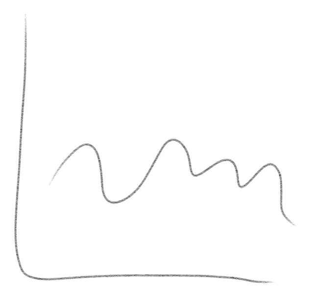{width=250px} | 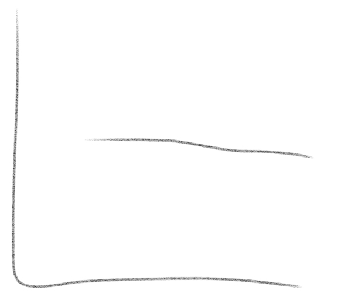{width=250px} |

## straightness

How well the curve can be approximated by a straight line (S4.5)

| **high** | **low** |
| :----: | :----: |
| {width=250px} | {width=250px} |

## prominence

This is the topographic definition where it's the height of the curve

## steepness

Related to the average slope

| **high** | **low** |
| :----: | :----: |
| 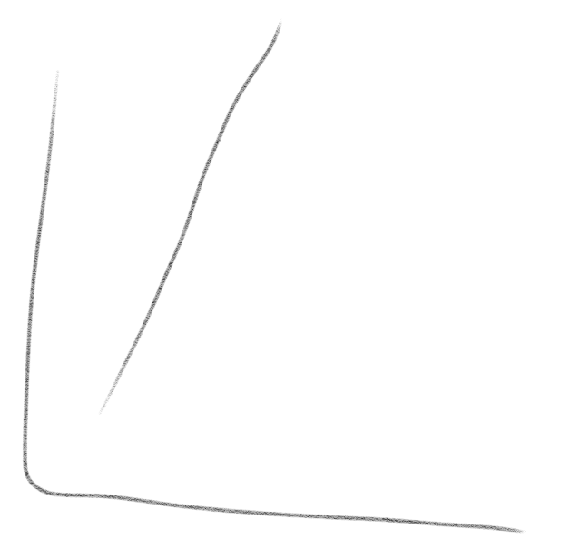{width=250px} | 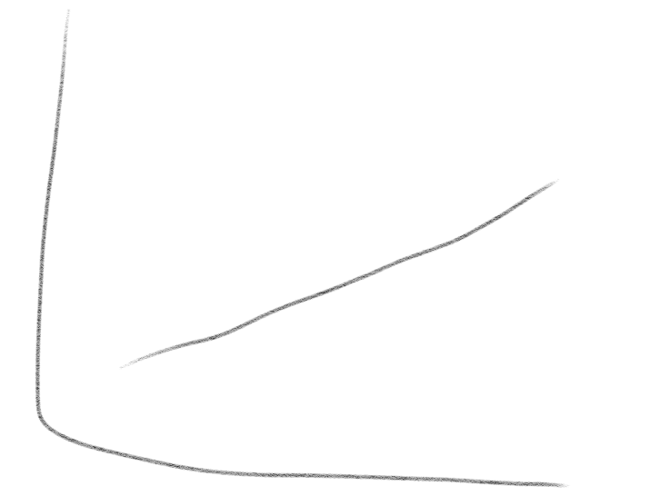{width=250px} |

## sinuosity 

- (from Chris weaver, evacuation scenario) 
- ratio of arc length to straight line distance

## curvature

| **high** | **low** |
| :----: | :----: |
| 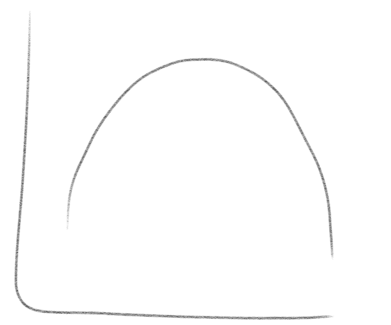{width=250px} | 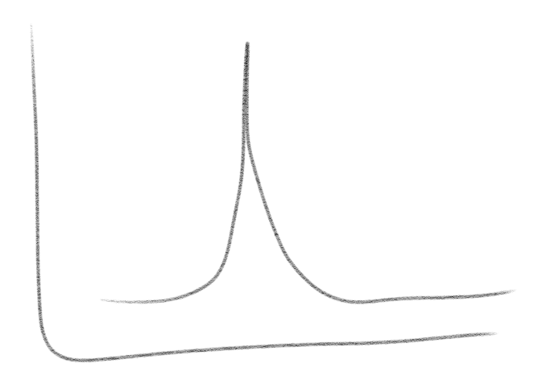{width=250px} |

## bowlness

A measure of how well the curve can be approximated by a parabola (S4.5)

| **high** | **low** |
| :----: | :----: |
| 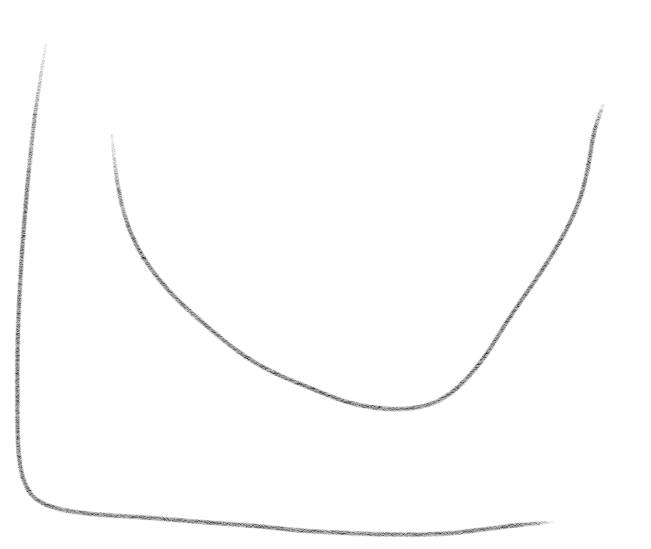{width=250px} | 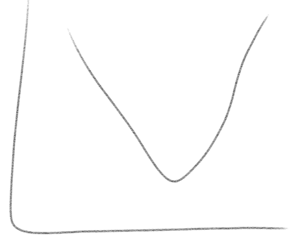{width=250px} |

## monotonically increasing

| **high** | **low** |
| :----: | :----: |
| 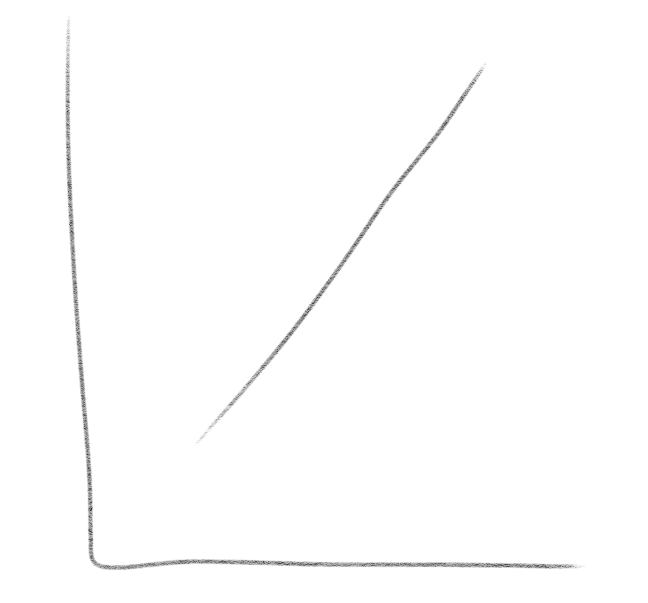{width=250px} | 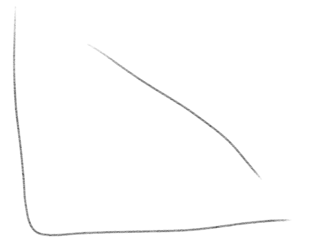{width=250px} |

## monotonically decreasing

| **high** | **low** |
| :----: | :----: |
| {width=250px} | {width=250px} |

## generally increasing

This is the ratio of the height of the curve at the start to the end

| **high** | **low** |
| :----: | :----: |
| 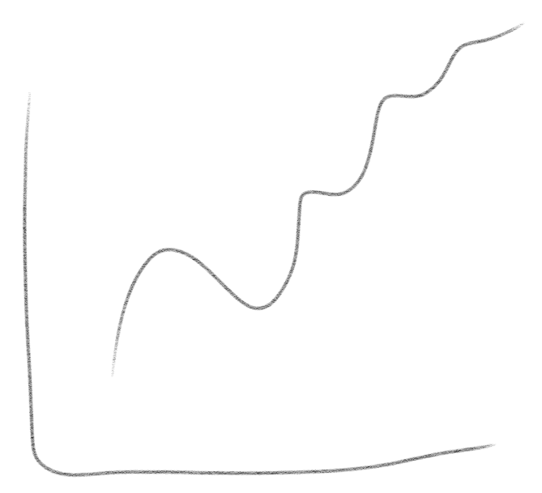{width=250px} | 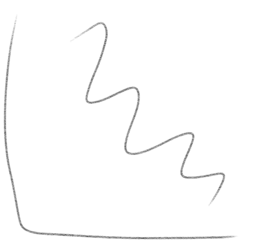{width=250px} |

## generally decreasing

This is the ratio of the height of the curve at the start to the end

| **high** | **low** |
| :----: | :----: |
| {width=250px} | {width=250px} |

## symmetry

This can be based on the skewness calculation (S4.2)

| **high** | **low** |
| :----: | :----: |
| 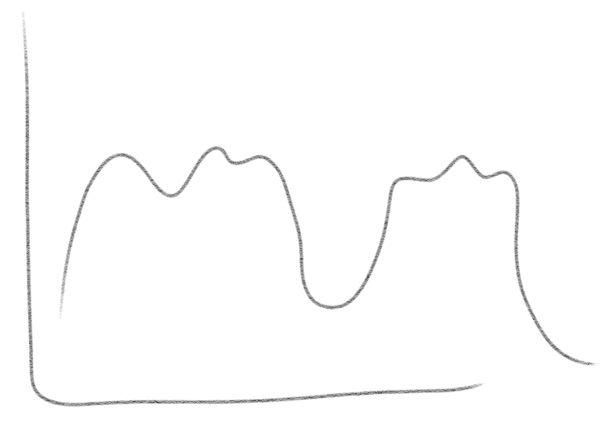{width=250px} | {width=250px} |

## ??? (band depth)

Generalizes median (or centrality) to manifolds: https://www.tandfonline.com/doi/abs/10.1198/jcgs.2011.09224

| **high** | **low** |
| :----: | :----: |
| 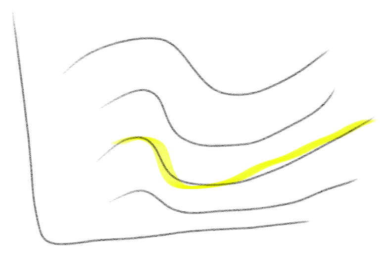{width=250px} | 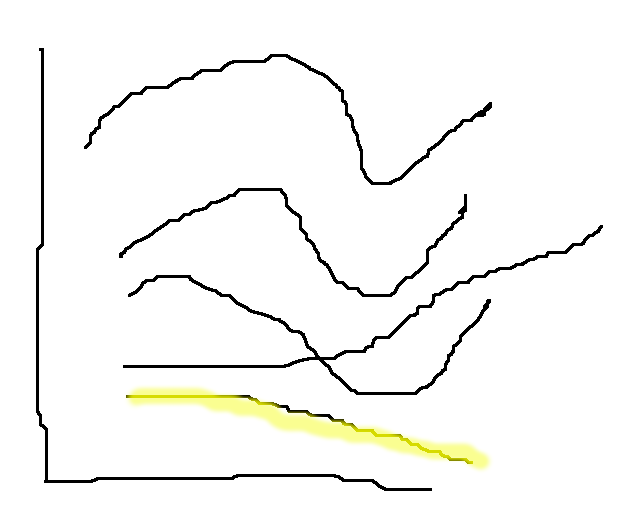{width=250px} |

## ??? (2nd derivative)

## ??? (global sensitivity measures)

There are several of these. See Global Sensitivity Analysis. The Primer by
Andrea Saltelli Marco Ratto Terry Andres Francesca Campolongo Jessica Cariboni
Debora Gatelli Michaela Saisana Stefano Tarantola
(https://onlinelibrary.wiley.com/doi/book/10.1002/9780470725184) for a list.

* Average gradient
* Variance-based
* Regression coefficients
* Fourier amplitude sensitivity test
* High-dimensional model representations
* Contribution to the sample mean plot (https://www.sciencedirect.com/science/article/pii/S0951832008002743?via%3Dihub)

## ??? (peak value)

## ??? (length)

Either arc length or length of time

## ??? (average)

## ??? (variance)

## ??? (PCA coefficients)

Looking at the first 4

## ??? (Fourier coefficients)

## ??? (Polynomial fits)

linear/quadratic/cubic fits

## ??? (Auto-regressive values)

Predicting a value based on linear combination of the previous $n$ values.

